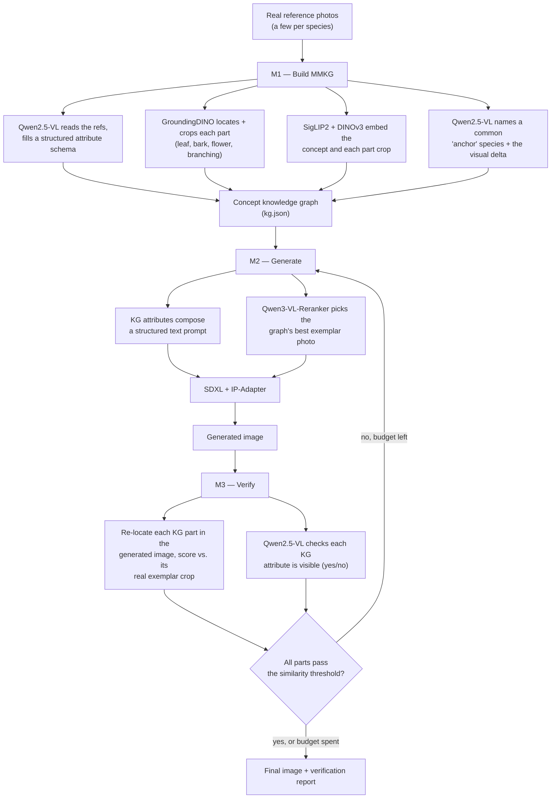

# GRAFT — Phase 1 Report

**Graph-grounded, Reference-Anchored, Fidelity-Tested rare-concept generation**

Date: 2026-08-27
Workspace: `ndbao_hbngoc/kg_test`

---

## 1. Summary

Text-to-image models like SDXL and FLUX fail on **rare concepts** — species, objects, and
culturally specific subjects that are underrepresented in their training data. Prompting for
"a monkey puzzle tree" yields a generic conifer, because the model never learned the concept's
distinguishing structure.

**GRAFT** is a training-free method that fixes this by building a **multimodal knowledge graph
(MMKG)** from a handful of real reference photos of the rare concept, and using that graph to
steer generation.

### Why this path

The closest prior work is **RAVEL / Context Canvas** (arXiv 2412.09614 — the same paper; v1 was
titled "Context Canvas", v2 "RAVEL"). It is also a training-free, graph-based RAG method for
T2I models, but it rests on three assumptions we chose to break:

1. Its knowledge graph is **LLM-recalled symbolic text** (an LLM lists attributes from memory)
   — explicitly *not* multimodal, and it says so: it's built to work "in the absence of visual
   priors."
2. It assumes the **LLM already knows** the rare concept's attributes well enough to recall them
   correctly.
3. Both its steering and its self-correction operate **at the prompt level** — it rewrites or
   expands text, never touches the image pipeline more directly.

GRAFT's wedge: build the graph **from real reference images**, so attributes are visually
verified rather than recalled, and steer generation **below the prompt** — through reference
image conditioning and part-level, visually-grounded verification, not text alone.

We also compare against **ImageRAG**, an in-workspace reference-guided generation method that
retrieves a single unstructured reference image. GRAFT's structured, part-decomposed graph plus
an anchor-concept field is the intended improvement over that flat retrieval.

Everything is training-free: no fine-tuning, no LoRA, no textual inversion. Every model used is
an off-the-shelf checkpoint, already cached locally, run purely at inference time.

---

## 2. Method

Three stages. All models run at inference time only.

**M1 — Build the MMKG.** Qwen2.5-VL reads a handful of real reference photos and fills a fixed
schema — global attributes (overall form, canopy/silhouette, color palette) and per-part
attributes (leaf, bark, cone/flower, branching) — describing only what it actually sees.
GroundingDINO locates and crops each named part in one reference photo; SigLIP2 and DINOv3 embed
the whole concept and every part crop. A separate pass asks Qwen2.5-VL to name the nearest
*common, generatable* neighbor concept (the "anchor") and the concrete visual differences (the
"delta") — this field is stored now but consumed by the Phase 2 editing lever, not Phase 1.
Qwen3-VL-Reranker ranks the reference photos so the best one is used first downstream. The result
is persisted as `kg.json`.

**M2 — Generate.** The KG's attributes (visually-sourced ones first) are joined into a text
prompt. The reranker selects the graph's best exemplar photo, which conditions SDXL through
**IP-Adapter** alongside the text prompt.

**M3 — Verify & refine.** Each KG part is re-located in the generated image (GroundingDINO) and
scored against its real exemplar crop (SigLIP2/DINOv3 cosine similarity); each KG attribute is
separately checked by asking Qwen2.5-VL a yes/no question. If any part scores below threshold or
attribute accuracy is too low, the pipeline re-seeds and tries again, up to a small attempt
budget; otherwise it returns the best attempt seen.

**Explicitly not done in Phase 1** (by design, to stay training-free and keep the method
simple): no fine-tuning/LoRA/textual inversion; no cross-attention or regional-attention surgery
on the diffusion model; no part-compositing/"Frankenstein" image editing. FLUX-Kontext-based
anchor→delta editing (using the anchor/delta field M1 already produces) is deferred to Phase 2.

---

## 3. Metrics

| Metric | What it measures | Role |
|---|---|---|
| **DINOv3 fidelity** | Mean cosine similarity between the generated image's DINOv3 embedding and each held-out *real* reference photo's embedding | Primary |
| **SigLIP2 fidelity** | Same, with SigLIP2 embeddings | Primary |
| **CLIP-I fidelity** | Same, with CLIP (laion ViT-L/14) embeddings | Primary |
| **Attribute accuracy** | Fraction of the concept's KG attribute clauses that Qwen2.5-VL confirms ("yes") are visible in the generated image | Secondary |
| **CLIP-T** | CLIP cosine similarity between the generated image and the plain prompt "a photo of a `{concept}`" | Secondary, known-weak |

The three fidelity metrics are the ones that matter most: they directly ask "does this image
look like the real rare thing," scored against photos the model never saw. CLIP-T is reported
but expected to be a weak signal here — CLIP's training data likely has thin or wrong-name
coverage of these species, so text-image alignment doesn't reliably track visual correctness for
rare concepts.

All embeddings are L2-normalized before scoring, so "cosine similarity" reduces to a plain dot
product.

---

## 4. Experiments

**Dataset.** [Treevill](https://www.kaggle.com/datasets/shuvokumarbasak4004/treevill-n-b-g-unique-and-rare-raw-dataset)
(66 tree/plant species, ~2,000 raw photos each). **Finding during setup:** the per-species
folders are heavily duplicated — hand-checked, most species have only a handful of *unique*
photos copied hundreds of times each:

| Species | Unique images (of ~2,000 files) |
|---|---|
| Akashmoni | 2 |
| Aloe Wood | 3 |
| Australian Pine | 3 |
| Ashore | 9 |
| Avocado | 10 |
| Ashok | 15 |

The loader dedupes by content hash before any train/held-out split, so a duplicate photo can
never appear on both sides of that split (which would otherwise make fidelity scoring trivially
perfect). A species is only usable if it has more unique images than `k_build_refs` (5): the
build split takes the first 5 for the MMKG, and the rest are held out for scoring. Species with
too few unique images are automatically skipped rather than run on an empty held-out set.

**Baselines.**

- **B0 — vanilla**: plain SDXL prompt ("a photo of a `{concept}`"), no KG, no reference image.
- **B1 — flat retrieval** (ImageRAG-style): one reference photo, retrieved by SigLIP2 text→image
  similarity from the same build pool, conditions SDXL via IP-Adapter. No graph structure, no
  anchor.
- **B2 — RAVEL-style reproduction**: Qwen2.5-VL lists attributes from its own memory (no image
  shown), expanded into the same prompt template as GRAFT, text-only SDXL. This isolates the
  "visually grounded + reference-conditioned" contribution — it's the closest reproduction of
  RAVEL/Context Canvas's own mechanism we could run against this dataset.

**Setup.** `k_build_refs = 5`, `ip_scale = 0.6`, `n_refine = 1` (one retry on top of the first
attempt; trimmed from the class default of 2 to keep each case's wall-clock and GPU-memory
footprint down, since this evaluation shares a single RTX 4090 with other researchers' jobs).
Requested 6 species (alphabetically first): Akashmoni, Aloe Wood, Ashok, Ashore, Australian Pine,
Avocado, × 4 methods (ours, B0, B1, B2) = 12 planned cases.

**What actually ran.** Akashmoni, Aloe Wood, and Australian Pine were auto-skipped (too few
unique images, see table above) — leaving **3 species × 4 methods = 12 cases**. One case
(Avocado / GRAFT) failed: its first generation attempt crashed with a transient process-level
error, unrelated to the method itself (see engineering note below). The run's per-case isolation
caught this cleanly and logged a skip rather than losing the rest of the run, but the current
retry logic doesn't treat this failure class the same as a GPU-memory error, so it wasn't retried
within its attempt budget — a fixable gap, noted in Next Steps. **11 of 12 cases completed.**

**Engineering note.** Getting a stable multi-hour, multi-model-load run out of this pipeline
took real debugging: intermittent segfaults under sustained load/unload cycling of several large
models in one process, plus a real CUDA memory leak from disabling Python's garbage collector as
a first attempted fix. The robust fix was architectural — every GPU-touching phase (building a
graph, one generation attempt, one baseline, one metrics computation) now runs in its own
disposable subprocess, so a crash in one phase can't take down the whole run. This is now the
standing execution model for GRAFT, not a one-off workaround.

---

## 5. Results

Mean score per method across all completed cases (n = 11: Ashok ×4, Ashore ×4, Avocado ×3).

| Method | DINOv3 | SigLIP2 | CLIP-I | Attr. accuracy | CLIP-T |
|---|---|---|---|---|---|
| **GRAFT (ours)** | 0.226 | 0.710 | 0.633 | 0.611 | 0.203 |
| B0 — vanilla | 0.018 | 0.539 | 0.351 | 0.222 | 0.246 |
| B1 — flat retrieval | **0.278** | **0.733** | **0.665** | **0.778** | 0.211 |
| B2 — RAVEL-style repro | 0.031 | 0.560 | 0.427 | 0.333 | 0.216 |

(Bold = best method per column. Full per-case numbers: `kg_test/outputs/eval/results.json`.
Generated images: `kg_test/outputs/<species>/eval_images/`.)

---

## 6. Conclusion

**GRAFT clearly beats the two baselines it was designed to beat.** Against B0 (no grounding at
all), GRAFT is 12.6× better on DINOv3 fidelity. Against B2 (our reproduction of RAVEL/Context
Canvas's own mechanism — text-only, LLM-recalled attributes), GRAFT is 7.2× better on DINOv3
fidelity and roughly double B2's attribute accuracy. This validates the core thesis: grounding a
knowledge graph in real reference images and conditioning generation on a real exemplar photo
measurably beats both "no grounding" and "LLM-recalled symbolic grounding."

**GRAFT does not yet beat B1 (flat single-reference retrieval)** on any metric except CLIP-T,
where the four methods are close. On this sample, the simpler baseline — one retrieved photo, no
graph structure — wins. This is an honest result, not a partial win to spin: GRAFT's added
structure (part decomposition, attribute schema, verify-refine loop) did not translate into
better fidelity than just picking a good single reference and conditioning on it directly.

**This is a pilot, not a benchmark.** Eleven cases across three species is not enough to draw a
confident conclusion about the GRAFT-vs-B1 gap specifically — it could be real, or it could be
sample noise, or it could be specific to how these three species' reference photos happened to
look. The B0/B2 comparisons are large enough margins (7–12×) that they're likely to hold up; the
B1 comparison needs a bigger run to trust.

---

## 7. Next steps

**Immediate follow-ups (cheap, before scaling up):**

- Make the refine loop tolerate a worker crash the same way it already tolerates a GPU-memory
  error (retry the next seed instead of failing the case outright) — closes the one lost case
  from this run.
- Re-select the species sample by unique-image count instead of alphabetical order, so a
  requested "N species" run doesn't burn slots on species the dataset can't actually support.
- Investigate the GRAFT-vs-B1 gap directly: is the VLM-read attribute text too generic (some
  species' schema came back fairly non-specific, e.g. "tree / full / green")? Is `ip_scale = 0.6`
  under-weighting image conditioning relative to the text prompt compared to B1's simpler setup?
- Re-run at a larger sample size (more species, ideally all Treevill species with enough unique
  images) now that the pipeline is proven stable end-to-end, to get a result worth trusting on
  the B1 comparison.

**Phase 2 (already scoped in the original design, deferred from Phase 1):**

- **Lever B — FLUX-Kontext anchor→delta editing.** M1 already produces an anchor species (a
  common, generatable neighbor) and a delta (the concrete visual differences) for every concept;
  Phase 2 draws the anchor with FLUX and applies the delta as an edit instruction via
  FLUX-Kontext, rather than generating from scratch. FLUX-Kontext running nf4-quantized on this
  same single-GPU setup is already proven elsewhere in this workspace.
- **In-loop targeted region edits.** Replace M3's current re-seed-on-failure strategy with a
  targeted Kontext edit of just the failing part, once Lever B is in place.
- **Full benchmark.** Run over the complete, duplication-aware Treevill species pool (all
  species with enough unique images, not just a sample), with FID/diversity metrics added if the
  sample budget allows.
